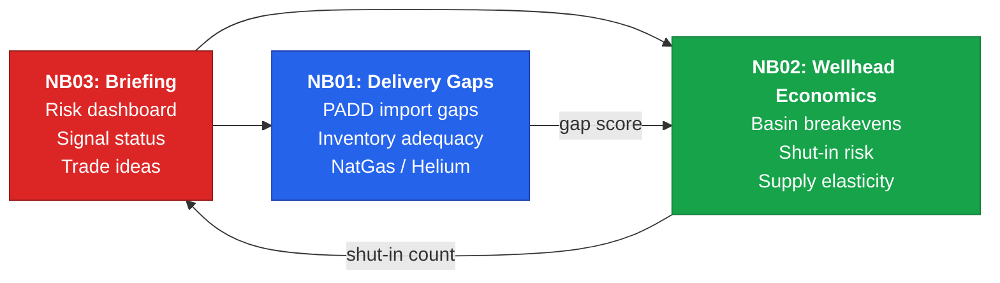
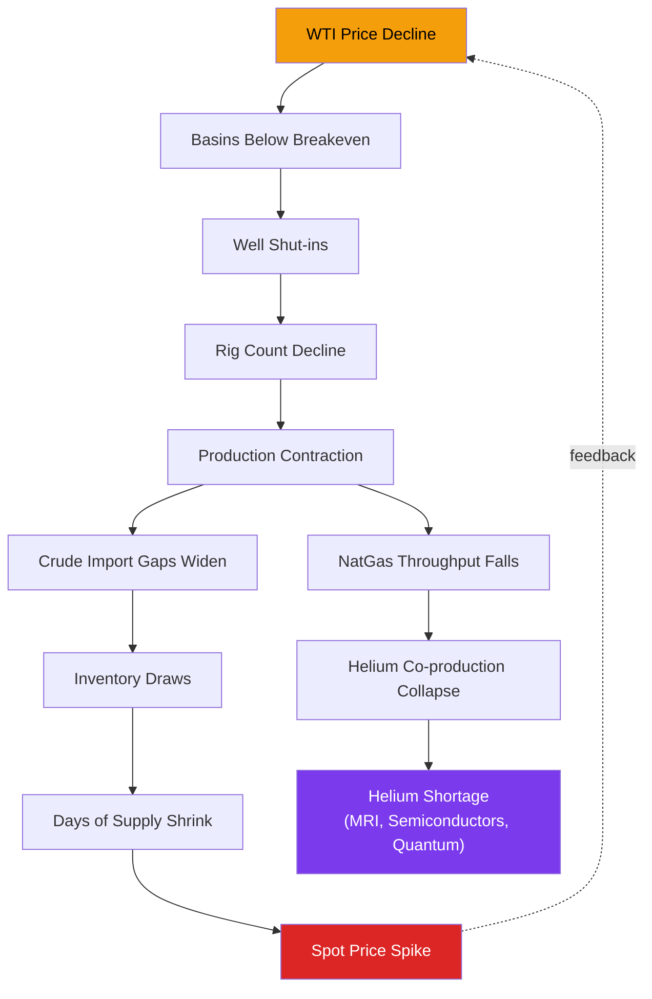
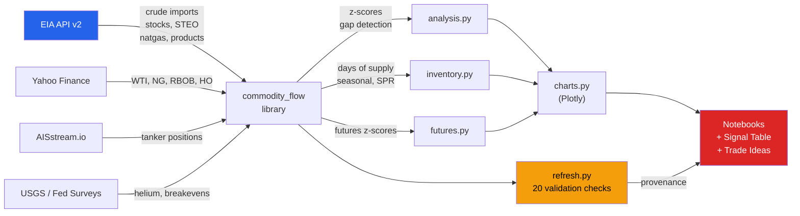

# Commodity Flow Intelligence

Physical commodity flow analytics -- delivery gap detection, inventory analysis, wellhead economics, and derivative supply chain signals using public government data.

## Thesis

Helium has no substitute and is extracted as a byproduct of natural gas processing. **Natural gas import and production disruptions are a leading indicator for helium supply gaps.** More broadly, physical delivery data from the EIA reveals supply-demand imbalances weeks before they surface in spot prices.

This project combines:
- **PADD-level crude import gap detection** using trailing z-scores
- **Inventory analytics** -- days of supply, seasonal comparisons, SPR vs commercial split
- **Wellhead economics** linking basin breakeven costs to shut-in risk
- **Commodity futures overlays** to identify physical-vs-market divergence
- **Real-time tanker tracking** via AIS vessel data
- **Automated signal grading** with threshold-based alerts and trade idea generation

All analysis runs on free, public data. No API keys are required to explore the notebooks -- offline data calibrated from published EIA/USGS/Fed values runs automatically when no keys are configured.

---

### Run the Notebooks

#### Run in Colab
All three notebooks are configured to run in **Google Colab** with zero local setup.

| Notebook | Focus | Link |
| :--- | :--- | :--- |
| **Market Intelligence Briefing** | Risk dashboard, signal status, scenario analysis, trade ideas -- start here | [](https://colab.research.google.com/github/hb-cam/commodity-flow-intelligence/blob/main/notebooks/03_market_intelligence_briefing.ipynb) |
| **Delivery Gap Analysis** | PADD import gaps, stock drawdowns, inventory analytics, NatGas/helium, composite scorecard, futures overlay, AIS tracking | [](https://colab.research.google.com/github/hb-cam/commodity-flow-intelligence/blob/main/notebooks/01_delivery_gap_analysis.ipynb) |
| **Wellhead Economics** | Basin breakeven analysis, production-at-risk curves, supply elasticity, rig count trends, double-signal assessment | [](https://colab.research.google.com/github/hb-cam/commodity-flow-intelligence/blob/main/notebooks/02_wellhead_economics.ipynb) |

> [!TIP]
> **Using live EIA data in Colab:** When the notebook opens, you will be prompted to enter your [EIA API key](https://www.eia.gov/opendata/register.php) (free, instant registration). Press Enter to skip and use offline data instead.

#### How the notebooks connect

The three notebooks form a layered intelligence product:



- **NB03 (Briefing)** -- The headline. Start here for the current risk picture, signal status, scenario analysis, and trade ideas.
- **NB01 (Delivery Gaps)** -- The evidence. Deep-dive into where the physical supply gaps are and how severe.
- **NB02 (Wellhead Economics)** -- The root cause. Why gaps are forming: basin breakevens, shut-in risk, rig count declines.

Each notebook includes an **executive summary** with dynamically computed metrics, **signal callouts** after key charts, and **actionable takeaways** that connect back to the briefing.

#### Causal chain

The core analytical thesis traces a supply-side cascade from price to physical delivery:



#### Data flow



#### Run locally
```bash
git clone https://github.com/hb-cam/commodity-flow-intelligence.git
cd commodity-flow-intelligence
uv sync
uv run jupyter lab
```

All three notebooks run in offline mode using data calibrated from published historical values -- no API keys needed.

### Daily Signal Alerts

A GitHub Action runs the signal check every weekday morning after the EIA data release. If any signal exceeds its alert threshold, a GitHub issue is automatically created with the full signal table and a link to the Market Intelligence Briefing.

To enable: add your `EIA_API_KEY` to the repo's [Actions secrets](https://docs.github.com/en/actions/security-for-github-actions/security-guides/using-secrets-in-github-actions). You can also run the check locally:

```bash
uv run python scripts/signal_check.py
```

### Run Tests

```bash
uv run pytest -v                          # All 206 tests
uv run pytest tests/test_integration.py   # Cross-dataset consistency & calculations
uv run pytest tests/test_verification.py  # Domain sanity checks
uv run pytest tests/test_security.py      # Security checks
```

---

## What's Inside

| Path | Description |
|------|-------------|
| `notebooks/03_market_intelligence_briefing.ipynb` | **Start here.** Interactive risk dashboard (plotly), signal status table, scenario analysis, basin profitability, inventory adequacy, futures divergence, helium supply chain, trade ideas |
| `notebooks/01_delivery_gap_analysis.ipynb` | Deep-dive: executive summary, PADD import gaps with signal callouts, stock drawdowns, inventory analytics (days of supply, seasonal comparison, SPR), NatGas/helium, composite scorecard + STEO overlay, futures z-scores, AIS tanker tracker, key takeaways |
| `notebooks/02_wellhead_economics.ipynb` | Deep-dive: executive summary, basin breakevens vs WTI, production-at-risk, supply elasticity curve, rig count trends, output per rig, double-signal assessment with trade ideas |
| `src/commodity_flow/charts.py` | Plotly interactive charts -- scorecard, elasticity curve, days of supply, SPR, basin breakevens, futures divergence, risk dashboard, signal table |
| `src/commodity_flow/eia.py` | EIA API v2 client -- crude imports, stocks, STEO projections, natural gas imports, product-level stocks, product supplied |
| `src/commodity_flow/inventory.py` | Inventory analytics -- product-level stocks, days of supply, 5-year seasonal comparison, SPR vs commercial split |
| `src/commodity_flow/analysis.py` | Z-score gap detection, composite scorecard with unit-alignment validation, breakeven analysis, supply curves |
| `src/commodity_flow/futures.py` | Yahoo Finance futures overlay (WTI, NatGas, RBOB, Heating Oil) |
| `src/commodity_flow/ais.py` | AISstream.io async websocket client for real-time tanker tracking |
| `src/commodity_flow/offline.py` | Offline data generators — baselines calibrated to published EIA/USGS/Fed values with injected disruption scenario |
| `src/commodity_flow/provenance.py` | Data provenance tracker -- logs live vs offline source per dataset |
| `src/commodity_flow/refresh.py` | Data refresh pipeline with 20 built-in validation checks |
| `scripts/signal_check.py` | Daily signal check script -- fetches data, validates, computes signals, outputs JSON. Used by GitHub Actions and runnable locally. |
| `.github/workflows/daily-signal-check.yml` | GitHub Action: runs weekday mornings after EIA data release. Opens a GitHub issue when alert thresholds are breached. |
| `tests/` | 206 tests across 13 files -- see [Testing](#testing) |

## Data Sources

All data sources are free and publicly available.

| Source | What It Provides | Access |
|--------|-----------------|--------|
| [EIA API v2](https://www.eia.gov/opendata/) | Crude imports by PADD, weekly petroleum stocks (by product), product supplied (consumption proxy), STEO forward projections, natural gas imports (pipeline + LNG split) | Free, [register for key](https://www.eia.gov/opendata/register.php) |
| [AISstream.io](https://aisstream.io) | Real-time AIS vessel tracking -- tanker positions, ETAs, destinations | Free websocket API |
| [USGS Mineral Commodity Summaries](https://www.usgs.gov/centers/national-minerals-information-center) | Helium production and supply (annual) | Public domain |
| Dallas / Kansas City Fed Energy Surveys | Basin-level breakeven price estimates (quarterly) | Public |
| [Yahoo Finance](https://finance.yahoo.com) | Commodity futures: WTI crude, natural gas, RBOB gasoline, heating oil | Free, no key needed |

## Quick Start

### Prerequisites

- Python 3.12+
- [uv](https://docs.astral.sh/uv/) (Python package manager)
- A free [EIA API key](https://www.eia.gov/opendata/register.php) (optional -- offline mode works without it)

### Setup

```bash
git clone https://github.com/hb-cam/commodity-flow-intelligence.git
cd commodity-flow-intelligence

# Install dependencies
uv sync

# Configure API keys (optional)
cp .env.example .env
# Edit .env and add your keys
```

### API Keys

| Key | Required? | How to Get |
|-----|-----------|-----------|
| EIA API | No (offline mode works without it) | Free at [eia.gov/opendata](https://www.eia.gov/opendata/register.php) -- enables live import/stock/STEO/inventory data |
| AISstream.io | Optional | Free at [aisstream.io](https://aisstream.io) -- enables real-time tanker tracking |

Set them in `.env`:
```
EIA_API_KEY=your-key-here
AISSTREAM_API_KEY=your-key-here
USE_LIVE_API=true
```

Without keys, all three notebooks run in offline mode using data calibrated from published historical values with an injected disruption scenario for realistic analysis.

## Key Concepts

### Delivery Gap Detection
Each PADD (Petroleum Administration for Defense District) has a trailing 12-month import average. When actual imports fall more than 1 standard deviation below this norm, a **delivery gap** is flagged. Gaps across multiple PADDs compound into the composite scorecard.

### Inventory Analytics
Product-level inventory tracking across crude oil, total gasoline, distillate, jet fuel, propane, and residual fuel oil. Three views:
- **Days of supply** -- stocks divided by daily consumption rate. Below ~25 days for gasoline or ~30 days for distillate signals tight supply.
- **5-year seasonal comparison** -- current stocks vs the trailing 5-year average for the same week. The benchmark the market watches from the EIA weekly report.
- **SPR vs commercial** -- Strategic Petroleum Reserve levels vs commercial crude stocks, tracking the post-2022 SPR drawdown.

### Composite Gap Scorecard
Blends oil import z-scores with natural gas import z-scores into a single delivery-risk metric. The STEO forward overlay extends the scorecard into forecast territory using EIA's Short Term Energy Outlook, with a **confidence band** derived from historical STEO accuracy (MAE and RMSE in z-score space). Includes unit-alignment validation to catch data quality issues before they corrupt the signal.

### Wellhead Economics
At prevailing WTI price, which producing basins are above or below breakeven? When price drops below marginal cost, wells shut in, supply contracts, and delivery gaps widen downstream. The **supply elasticity curve** sweeps WTI from $30 to $100 and plots cumulative production at risk.

### Double Signal
The most actionable signal in the analysis. When **both** delivery gaps are widening (imports below norm) **and** basins are shutting in (below breakeven), supply contraction is accelerating faster than the market expects. NB02 evaluates both legs and generates specific trade ideas when the double signal fires.

### Physical vs. Market Divergence
The futures overlay compares physical delivery gap z-scores with commodity futures price z-scores. **Divergence** suggests the physical supply is tighter or looser than the market is pricing.

## Testing

206 tests across 13 files, organized by concern:

| File | Tests | What It Covers |
|------|-------|----------------|
| `test_unit_coherence.py` | 38 | Unit annotations, conversion arithmetic, dimensional algebra, cross-source schema agreement, provenance labels, round-trip inverses, chart axis labels, column naming conventions |
| `test_integration.py` | 30 | Cross-dataset consistency, calculation verification, input robustness, dimensional analysis |
| `test_verification.py` | 33 | Domain sanity checks against EIA/USGS/Fed benchmarks, unit-alignment warnings |
| `test_offline.py` | 21 | Generator shapes, determinism, disruption injection |
| `test_security.py` | 15 | Credential hygiene, input validation, coordinate rejection, protocol checks |
| `test_inventory.py` | 14 | Days of supply, seasonal comparison, SPR, offline inventory |
| `test_analysis.py` | 12 | Z-scores, scorecard structure, breakeven classification, supply curves |
| `test_eia.py` | 10 | URL construction, PADD normalization, STEO rename, schema guards |
| `test_provenance.py` | 10 | Summary rendering, timestamps, live/offline tags |
| `test_charts.py` | 8 | Plotly chart functions return Figures, signal table status values |
| `test_futures.py` | 6 | Mocked yfinance, z-score computation, bounds |
| `test_ais.py` | 6 | Position report parser, coordinate validation, bounding boxes |
| `test_refresh.py` | 5 | Full pipeline execution, all validations pass |

## Tech Stack

- **Python:** pandas, numpy, matplotlib, plotly, statsmodels, requests, aiohttp, yfinance
- **Data:** EIA API v2, AISstream.io, USGS, Dallas/KC Fed Surveys, Yahoo Finance
- **Visualization:** Plotly (interactive dashboards) + Matplotlib (multi-panel grids)
- **Decomposition:** STL (Seasonal-Trend-Loess) via statsmodels for seasonal pattern analysis
- **Package management:** uv
- **CI/CD:** GitHub Actions daily signal check with automated issue creation
- **Testing:** pytest (206 tests -- integration, verification, security, charts, domain)

## Contributing

Contributions are welcome. Whether you are adding a new data source, improving the analysis, or fixing a bug:

1. **Fork & Clone**: Fork the repository and clone locally.
2. **Setup**: Run `uv sync` to install all dependencies.
3. **Branch**: Create a feature branch (`git checkout -b feature/your-feature`).
4. **Test**: Run `uv run pytest -v` before submitting. All 206 tests should pass.
5. **PR**: Open a pull request with a clear description.

> [!NOTE]
> All three notebooks include a **data provenance table** that tracks which datasets are live vs offline, row counts, and date ranges. If you add a new data source, wire it through `provenance.py` and `refresh.py`.

## Questions & Issues

If you find a bug, have a question about the methodology, or want to suggest a new data source or signal, please [open an issue](https://github.com/hb-cam/commodity-flow-intelligence/issues).

## Contact

- **LinkedIn:** [hicksbruce](https://www.linkedin.com/in/hicksbruce)
- **GitHub:** [@hb-cam](https://github.com/hb-cam)

> [!TIP]
> Questions about the structural econometric approach, the EIA API integration, or extending the analysis to new commodities? Feel free to [open an issue](https://github.com/hb-cam/commodity-flow-intelligence/issues) or reach out via LinkedIn.

---

**License:** MIT -- see [LICENSE](LICENSE) for details.
